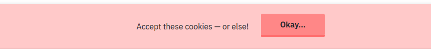
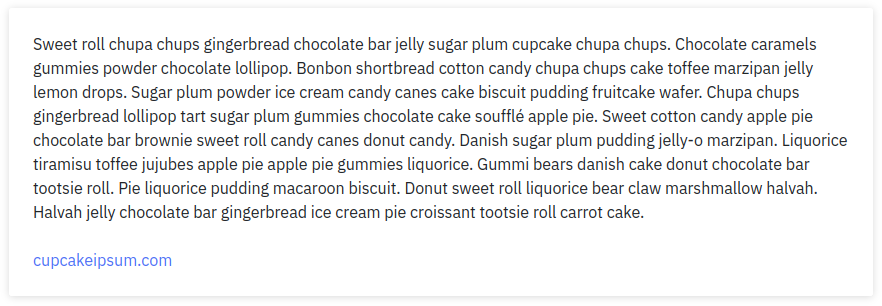
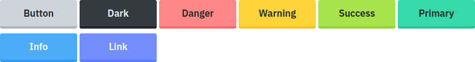

# Intro

This is a little CSS library. I hope to build other libraries on top of it someday.

[[screenshot](screenshot.png)]

# Installation

```bash
npm install --save @jrc03c/base-css
```

# Usage

```html
<!-- normalized -->
<link
  href="node_modules/@jrc03c/base-css/dist/base.norm.min.css"
  rel="stylesheet"
  type="text/css" />

<!-- non-normalized -->
<link
  href="node_modules/@jrc03c/base-css/dist/base.min.css"
  rel="stylesheet"
  type="text/css" />
```

The "normalized" version has [normalize.css](https://github.com/necolas/normalize.css/) baked in.

# Variables & utility classes

The following variables are available. The colors came from [@yeun/open-color](https://yeun.github.io/open-color/).

```css
:root {
  --spacing: 1.5rem;
  --spacing-xs: 0.25rem;
  --spacing-sm: 0.75rem;
  --spacing-md: 1.5rem;
  --spacing-lg: 3rem;
  --spacing-xl: 6rem;

  --border-radius: 3px;
  --line-thickness: 2px;
  --shadow: 0 1px 8px rgba(0, 0, 0, 0.15);

  --color-gray-0: #f8f9fa;
  --color-gray-1: #f1f3f5;
  --color-gray-2: #e9ecef;
  --color-gray-3: #dee2e6;
  --color-gray-4: #ced4da;
  --color-gray-5: #adb5bd;
  --color-gray-6: #868e96;
  --color-gray-7: #495057;
  --color-gray-8: #343a40;
  --color-gray-9: #212529;
  --color-red-0: #fff5f5;
  --color-red-1: #ffe3e3;
  --color-red-2: #ffc9c9;
  --color-red-3: #ffa8a8;
  --color-red-4: #ff8787;
  --color-red-5: #ff6b6b;
  --color-red-6: #fa5252;
  --color-red-7: #f03e3e;
  --color-red-8: #e03131;
  --color-red-9: #c92a2a;
  --color-pink-0: #fff0f6;
  --color-pink-1: #ffdeeb;
  --color-pink-2: #fcc2d7;
  --color-pink-3: #faa2c1;
  --color-pink-4: #f783ac;
  --color-pink-5: #f06595;
  --color-pink-6: #e64980;
  --color-pink-7: #d6336c;
  --color-pink-8: #c2255c;
  --color-pink-9: #a61e4d;
  --color-grape-0: #f8f0fc;
  --color-grape-1: #f3d9fa;
  --color-grape-2: #eebefa;
  --color-grape-3: #e599f7;
  --color-grape-4: #da77f2;
  --color-grape-5: #cc5de8;
  --color-grape-6: #be4bdb;
  --color-grape-7: #ae3ec9;
  --color-grape-8: #9c36b5;
  --color-grape-9: #862e9c;
  --color-violet-0: #f3f0ff;
  --color-violet-1: #e5dbff;
  --color-violet-2: #d0bfff;
  --color-violet-3: #b197fc;
  --color-violet-4: #9775fa;
  --color-violet-5: #845ef7;
  --color-violet-6: #7950f2;
  --color-violet-7: #7048e8;
  --color-violet-8: #6741d9;
  --color-violet-9: #5f3dc4;
  --color-indigo-0: #edf2ff;
  --color-indigo-1: #dbe4ff;
  --color-indigo-2: #bac8ff;
  --color-indigo-3: #91a7ff;
  --color-indigo-4: #748ffc;
  --color-indigo-5: #5c7cfa;
  --color-indigo-6: #4c6ef5;
  --color-indigo-7: #4263eb;
  --color-indigo-8: #3b5bdb;
  --color-indigo-9: #364fc7;
  --color-blue-0: #e7f5ff;
  --color-blue-1: #d0ebff;
  --color-blue-2: #a5d8ff;
  --color-blue-3: #74c0fc;
  --color-blue-4: #4dabf7;
  --color-blue-5: #339af0;
  --color-blue-6: #228be6;
  --color-blue-7: #1c7ed6;
  --color-blue-8: #1971c2;
  --color-blue-9: #1864ab;
  --color-cyan-0: #e3fafc;
  --color-cyan-1: #c5f6fa;
  --color-cyan-2: #99e9f2;
  --color-cyan-3: #66d9e8;
  --color-cyan-4: #3bc9db;
  --color-cyan-5: #22b8cf;
  --color-cyan-6: #15aabf;
  --color-cyan-7: #1098ad;
  --color-cyan-8: #0c8599;
  --color-cyan-9: #0b7285;
  --color-teal-0: #e6fcf5;
  --color-teal-1: #c3fae8;
  --color-teal-2: #96f2d7;
  --color-teal-3: #63e6be;
  --color-teal-4: #38d9a9;
  --color-teal-5: #20c997;
  --color-teal-6: #12b886;
  --color-teal-7: #0ca678;
  --color-teal-8: #099268;
  --color-teal-9: #087f5b;
  --color-green-0: #ebfbee;
  --color-green-1: #d3f9d8;
  --color-green-2: #b2f2bb;
  --color-green-3: #8ce99a;
  --color-green-4: #69db7c;
  --color-green-5: #51cf66;
  --color-green-6: #40c057;
  --color-green-7: #37b24d;
  --color-green-8: #2f9e44;
  --color-green-9: #2b8a3e;
  --color-lime-0: #f4fce3;
  --color-lime-1: #e9fac8;
  --color-lime-2: #d8f5a2;
  --color-lime-3: #c0eb75;
  --color-lime-4: #a9e34b;
  --color-lime-5: #94d82d;
  --color-lime-6: #82c91e;
  --color-lime-7: #74b816;
  --color-lime-8: #66a80f;
  --color-lime-9: #5c940d;
  --color-yellow-0: #fff9db;
  --color-yellow-1: #fff3bf;
  --color-yellow-2: #ffec99;
  --color-yellow-3: #ffe066;
  --color-yellow-4: #ffd43b;
  --color-yellow-5: #fcc419;
  --color-yellow-6: #fab005;
  --color-yellow-7: #f59f00;
  --color-yellow-8: #f08c00;
  --color-yellow-9: #e67700;
  --color-orange-0: #fff4e6;
  --color-orange-1: #ffe8cc;
  --color-orange-2: #ffd8a8;
  --color-orange-3: #ffc078;
  --color-orange-4: #ffa94d;
  --color-orange-5: #ff922b;
  --color-orange-6: #fd7e14;
  --color-orange-7: #f76707;
  --color-orange-8: #e8590c;
  --color-orange-9: #d9480f;

  --font-size-1: 3em;
  --font-size-2: 2em;
  --font-size-3: 1.5em;
  --font-size-4: 1.25em;
  --font-size-5: 1em;
  --font-size-6: 0.85em;

  --font-sans-serif: system-ui, sans-serif;
  --font-serif: Rockwell, "Rockwell Nova", "Roboto Slab", "DejaVu Serif",
    "Sitka Small", serif;
  --font-monospace: ui-monospace, "Cascadia Code", "Source Code Pro", Menlo,
    Consolas, "DejaVu Sans Mono", monospace;

  --line-height: 1.5em;
  --min-button-width: 128px;
  --button-z-height: 4px;
  --brightness-active: 90%;
  --brightness-hover: 105%;
  --transition-duration: 0.1s;
}
```

Utility classes based on the above variable names are available. Here are their forms:

- `bg-COLOR-NUMBER` = sets the background color of an element (e.g., `bg-orange-1`)
- `text-COLOR-NUMBER` = sets the text color of an element (e.g., `text-lime-7`)

There are also a few standalone utility classes:

- `danger`
- `dark`
- `info`
- `light`
- `link`
- `primary`
- `success`
- `text-center`
- `text-justify`
- `text-left`
- `text-right`
- `warning`

# Components, elements, & classes

For the most part, I tried to style HTML elements directly based on semantics and without using class names. So, for example, anchor tags (`<a>`), headings (`<h1>` through `<h6>`), horizontal rules (`<hr>`), most form inputs (`<input>`, `<select>`, etc.), lists (`ol` and `ul`), and so on, all receive styles even though I haven't documented most of them below. The things that _are_ documented below either required class names or else were noteworthy for some other reason, like for unexpected behavior involving breakpoints or whatever.

## Banner (`.banner`)

A banner is a floating element that usually covers a bit of the page either at the very top or very bottom of the viewport. It is intended to be displayed above everything else on the page. Banners are commonly used to display cookie consent forms, for example.

Apply `top` or `bottom` classes to the banner element to place it at the top or bottom of the page. Apply classes like `danger`, `light`, etc., to indicate state.

**Example:**

```html
<div class="banner bottom danger">
  <div>Accept these cookies — or else!</div>
  <button>Okay...</button>
</div>
```



## Blockquote (`<blockquote>`)

**Example:**

```html
<blockquote>
  <p>
    <b>
      Gideon the Ninth
      <br />
      <span style="color: var(--color-gray-5)">by Tamsyn Muir</span>
    </b>
  </p>

  <p>
    In the myriadic year of our Lord — the ten thousandth year of the King
    Undying, the kindly Prince of Death! — Gideon Nav packed her sword, her
    shoes, and her dirty magazines, and she escaped from the House of the Ninth.
  </p>
</blockquote>
```


## Box (`.box`)

A box is a white element that has a shadow.

**Example:**

```html
<div class="box">
  <p>
    Sweet roll chupa chups gingerbread chocolate bar jelly sugar plum cupcake
    chupa chups. Chocolate caramels gummies powder chocolate lollipop. Bonbon
    shortbread cotton candy chupa chups cake toffee marzipan jelly lemon drops.
    Sugar plum powder ice cream candy canes cake biscuit pudding fruitcake
    wafer. Chupa chups gingerbread lollipop tart sugar plum gummies chocolate
    cake soufflé apple pie. Sweet cotton candy apple pie chocolate bar brownie
    sweet roll candy canes donut candy. Danish sugar plum pudding jelly-o
    marzipan. Liquorice tiramisu toffee jujubes apple pie apple pie gummies
    liquorice. Gummi bears danish cake donut chocolate bar tootsie roll. Pie
    liquorice pudding macaroon biscuit. Donut sweet roll liquorice bear claw
    marshmallow halvah. Halvah jelly chocolate bar gingerbread ice cream pie
    croissant tootsie roll carrot cake.
  </p>

  <p><a href="https://cupcakeipsum.com">cupcakeipsum.com</a></p>
</div>
```



## Button (`<button>`, `<input type="submit">`)

Apply classes like `danger`, `light`, etc., to indicate state.

**Examples:**

```html
<button>Button</button>
<button class="dark">Dark</button>
<button class="danger">Danger</button>
<button class="warning">Warning</button>
<button class="success">Success</button>
<button class="primary">Primary</button>
<button class="info">Info</button>
<button class="link">Link</button>
```



## Code (`<code>`)

## Columns (`.cols` + `.col`)

## Container (`.container`)

## Control (`.control`)

## Details (`<details>`)

## Dialog (`<dialog>`)

## Figure (`<figure>`)

## Footer (`<footer>`)

## Navigation (`<nav>`)

## Notification (`.notification`)

## Progress (`<progress>`)

## Row (`.row`)

## Section (`<section>`)

## Table container & table (`.table-container` + `<table>`)

## Tag (`.tag`)
